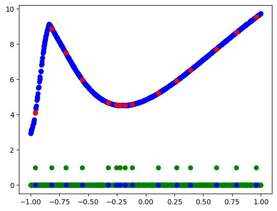
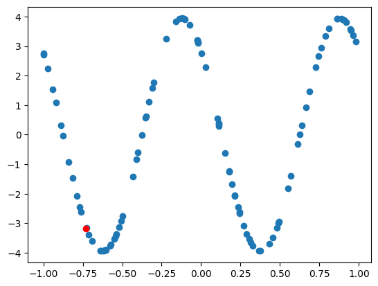
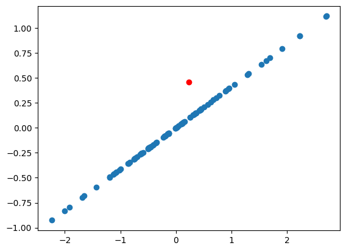

This notebook contains some experiments messing around with the model setup described in [General-Purpose In-Context Learning by Meta-Learning Transformers](https://arxiv.org/abs/2212.04458).
> Modern machine learning requires system designers to specify aspects of the learning pipeline, such as losses, architectures, and optimizers. Meta-learning, or learning-to-learn, instead aims to learn those aspects, and promises to unlock greater capabilities with less manual effort. One particularly ambitious goal of meta-learning is to train general-purpose in-context learning algorithms from scratch, using only black-box models with minimal inductive bias. Such a model takes in training data, and produces test-set predictions across a wide range of problems, without any explicit definition of an inference model, training loss, or optimization algorithm. In this paper we show that Transformers and other black-box models can be meta-trained to act as general-purpose in-context learners. We characterize phase transitions between algorithms that generalize, algorithms that memorize, and algorithms that fail to meta-train at all, induced by changes in model size, number of tasks, and meta-optimization. We further show that the capabilities of meta-trained algorithms are bottlenecked by the accessible state size (memory) determining the next prediction, unlike standard models which are thought to be bottlenecked by parameter count. Finally, we propose practical interventions such as biasing the training distribution that improve the meta-training and meta-generalization of general-purpose learning algorithms.

Tasks are generated by initializing a small MLP network with random weights across a large batch, then a small subset of the generated data points are masked out and marked as queries.

The transformer model is trained to fill in masked portions of these synthetic functions, and then positive transfer to known functions is tested.

I was able to roughly replicate the claim in the paper of general in-context modeling of basic functions.
